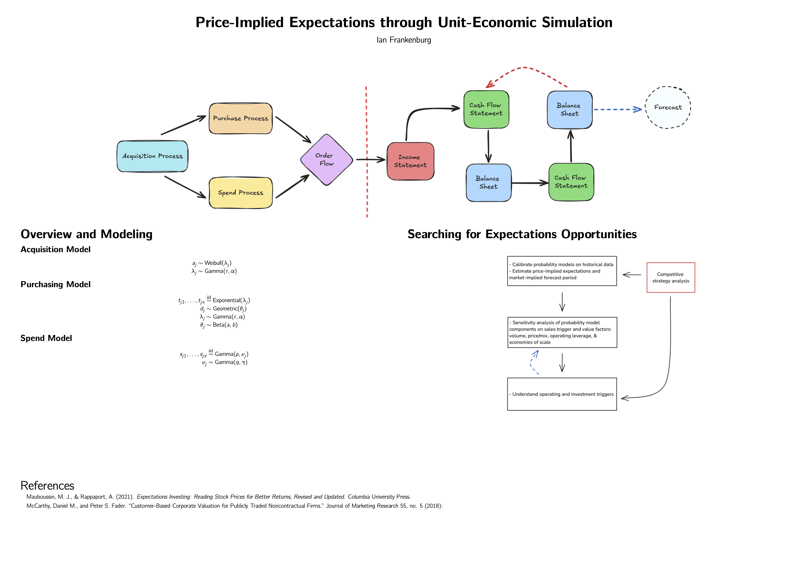

# Models for Customer Analytics

## Summarizing Buyer Behavior

Using transactions log data and marketing spend data we calculate:

1. Monthly sales over time
2. Total customers acquired
3. Customer acquisition cost (CAC)
4. Distribution of spend per purchase
5. Initial versus repeat sales volume
6. Initial versus repeat average order value (AOV)
7. Sales and AOV by source
8. First-purchase profitability
9. Cohorted sales (the “C3”)
10. Revenue retention curves
11. Cumulative spend per customer
12. Distribution of total spend by customer
13. Customer concentration (“Pareto”) chart

What the analysis summarize:

1. Growth
2. Unit costs
3. Unit profitability (unit economic performance)
4. Retention
5. Heterogeneity (customers, time)

## Models to Implement

- Weibull-Gamma acquisition model
- Exponential-Gamma retention model
- Point process transaction model
- Simulating order flow dynamics
- Acquisition process
- Purchase process
- Spend process

## Overview

