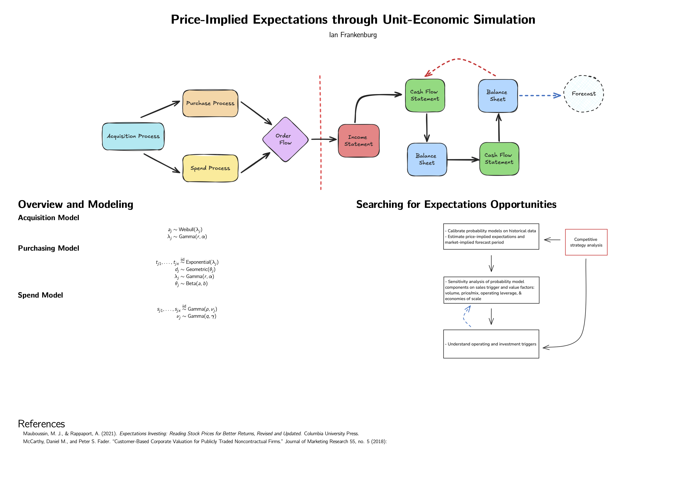
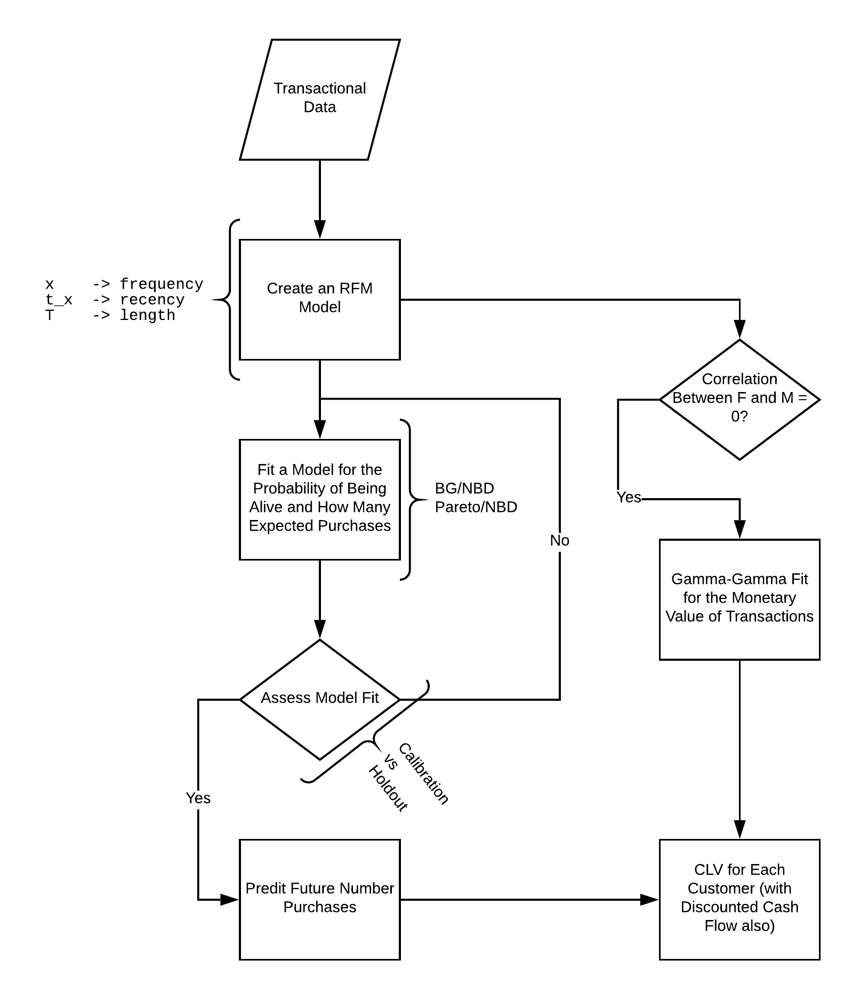

# Customer-Base Analytics

A research library of **probability models for customer-base analysis** — the Fader–Hardie tradition of parsimonious stochastic models that treat a customer's observed buying as the visible output of a latent behavioral process, and use it to project future purchasing, retention, and **customer lifetime value (CLV)**.

Each topic is a self-contained [Quarto](https://quarto.org) essay (mathematical exposition + executable Python) published to GitHub Pages: [**https://abdullahau.github.io/customer-analytics/**](https://abdullahau.github.io/customer-analytics/){.uri}

> **New here?** Read [The big idea](#the-big-idea-probability-models-for-buyer-behavior) for the one-page mental model, skim [the taxonomy](#dimension-1--the-firmcustomer-relationship-2×2-taxonomy) to see how the models relate, then jump to [Getting started](#getting-started) to run the code.

------------------------------------------------------------------------

## The big idea: probability models for buyer behavior {#the-big-idea-probability-models-for-buyer-behavior}

We only ever get a *"foggy window"* onto a customer's true tendencies: someone who bought twice last year is not necessarily a "two per year" buyer. So instead of extrapolating the observed numbers, we model the **latent process** that generated them. Two ingredients:

1.  **An individual-level model** for one customer's behavior given latent traits θ — e.g. Poisson (how many purchases), exponential/geometric (how long until they lapse), Bernoulli (buy vs. not).
2.  **A mixing distribution** (gamma, beta, …) describing how θ is spread across the customer base — i.e. **heterogeneity**.

Combining the two gives a **mixture model** for a randomly-chosen customer; Bayes' theorem then turns any customer's observed history into forward-looking inferences — **P(alive), expected future transactions, residual CLV** — typically from nothing more than **RFM** (recency, frequency, monetary value), which are the *sufficient statistics* for these models. Formally: `past = f(θ)` and `future = f(θ)`, in contrast to the regression / data-mining `future = f(past)` approach.

A recurring lesson from this literature is that many "dynamics" people try to model (a slowing aggregate purchase rate, retention rates that *rise* with tenure) are **not** individual-level effects at all — they are **sorting effects** that fall out of heterogeneity: the low-θ customers survive longer and come to dominate the surviving population ("the ruse of heterogeneity"). Don't "fix" them with ad-hoc time trends.

## Dimension 1 — the firm–customer relationship (2×2 taxonomy)

Two questions classify any customer base (Schmittlein, Morrison & Colombo 1987; Fader & Hardie 2009) and **determine which model is even admissible**:

- **Is churn observed?** *Contractual* (the customer cancels / fails to renew — we see it) vs. *non-contractual* (the customer just silently stops — "silent attrition", and we must infer whether they are dead or merely dormant).
- **Can transactions happen anytime?** *Continuous* vs. *discrete* (only at fixed epochs).

The contractual/non-contractual boundary is **fundamental — a model built for one side must never be applied to the other.**

|   | **Non-contractual** (churn latent) | **Contractual** (churn observed) |
|-------------------|-----------------------------|------------------------|
| **Continuous** (any time) | grocery, hotel, mail-order → **Pareto/NBD, BG/NBD, NBD, NBD/OTB** | credit card, mobile, utilities → **exponential-gamma, Weibull-gamma** |
| **Discrete** (fixed epochs) | event attendance, charity drives, refills → **BG/BB** | magazine/SaaS subs, insurance, gym → **sBG, BdW** |

In **non-contractual** settings the modelling challenge is telling a dead customer apart from one in a long hiatus; in **contractual** settings churn is known, so the focus shifts to **duration / retention** and projecting the survivor curve.

## Dimension 2 — the building blocks (counting / timing / choice)

Every model is assembled from — and usually **integrates** — three process types, each an individual-level model paired with a heterogeneity distribution:

| Block | Question | Individual model → with heterogeneity |
|------------------|------------------|------------------------------------|
| **Counting** | how many? | Poisson → **NBD** (gamma); Bernoulli → **beta-Binomial** (beta) |
| **Timing** | when / how long alive? | exponential → **Pareto / exp-gamma**; geometric → **sBG**; Weibull → **Weibull-gamma / BdW** |
| **Choice** | whether / which / how much? | Bernoulli/binomial (buy-vs-not, brand, one-time-buyer); spend → **Gamma-Gamma** |

**Integrated models** combine the blocks to solve jointly for the latent parameters:

- **Counting + Timing** — a purchasing process *and* an "alive/death" process: **Pareto/NBD** (Poisson-gamma buying + exponential-gamma dropout), **BG/NBD** (dropout after a purchase, beta-geometric), **BG/BB** (their discrete analog). Also "stickiness" (# visits × duration/visit) and new-product **trial timing + repeat counting** (depth-of-repeat).
- **Counting + Counting** — purchase *volume* (# transactions × units/transaction); page views (# visits × pages/visit).
- **Counting + Choice** — brand purchasing (category incidence × brand choice), "conversion" (# visits × buy/not-buy), and the **NBD/OTB** one-time-buyer split.

Layer a **spend sub-model** (Gamma-Gamma) on a purchasing model and you get monetary value → **CLV = margin × revenue/transaction × DET** (discounted expected transactions). Roll **acquisition + retention + spend** together and you get firm-level **customer-based corporate valuation (CBCV)**.

## The recurring math (one screen)

The same handful of moves reappears in every essay:

- **Mixture = individual model integrated over heterogeneity.** Each closed form comes from `∫ P(data | θ) g(θ) dθ`: Poisson × gamma → **NBD**; geometric × beta → **sBG**; binomial × beta → **beta-Binomial**; exponential × gamma → **exponential-gamma/Pareto**.
- **Forward recursions** make the models spreadsheet-cheap. NBD: `P(X=x) = (r+x−1)/(x(α+1)) · P(X=x−1)`, from `P(X=0)=(α/(α+1))ʳ`. sBG: `P(T=t) = (β+t−2)/(α+β+t−1) · P(T=t−1)`, from `P(T=1)=α/(α+β)`.
- **Estimation** is by **maximum likelihood** on the frequency counts (often just Excel Solver), or **Bayesian** (Stan / BridgeStan) for the `-stan` essays.
- **Individual-level inference via Bayes.** The posterior `g(θ | data) ∝ P(data | θ) g(θ)` yields P(alive), expected future transactions, and — for spend/response — **regression-to-the-mean**: the best estimate is a precision-weighted blend of the customer's own history and the population mean.
- **Goodness of fit** via the χ² statistic `Σ (fᵢ − npᵢ)² / npᵢ` against the observed histogram.
- **CLV** discounts expected future transactions (DET) and multiplies by margin × revenue/transaction; **iso-value curves** trace equal-CLV contours across the recency/frequency plane.

## The model catalogue

Rendered pages are linked from [`index.qmd`](index.qmd); sources live under [`notebooks/`](notebooks/), organized by purpose.

| Essay (`notebooks/…`) | Taxonomy cell | Building blocks | The idea |
|-----------------|-----------------|-----------------|---------------------|
| `models/purchasing/nbd-overview` | non-contractual, cont. | counting | Poisson buying + gamma heterogeneity; no death. Baseline for `E[X(t)]`. |
| `models/purchasing/nbd-otb` | non-contractual, cont. | counting + choice | NBD plus a "one-time buyer" spike-at-zero segment. |
| `models/purchasing/bg-nbd` (+ `-stan`) | non-contractual, cont. | counting + timing | Dropout *after a purchase* (beta-geometric). Easy MLE (even Excel). P(alive), `E[Y(t)｜x,tₓ,T]`. |
| `models/purchasing/pareto-nbd` | non-contractual, cont. | counting + timing | Dropout at *any* time (exponential-gamma). The original SMC model; harder to estimate. |
| `models/purchasing/bg-bb` | non-contractual, disc. | counting + timing | Discrete analog of Pareto/NBD (beta-Bernoulli buying + beta-geometric death); donation incidence. |
| `models/retention/beta-geometric` (sBG) | contractual, disc. | timing | Constant individual retention + beta heterogeneity; aggregate retention *rises* with tenure. |
| `models/retention/beta-discrete-weibull` (BdW) | contractual, disc. | timing | sBG generalized to allow duration dependence (Weibull). |
| `models/retention/subscription-retention` | contractual, disc. | timing | Discrete-time contractual retention applied; plus the interactive `sBG-Model.py` (marimo). |
| `models/acquisition/depth-of-repeat` | new-product | timing + counting | Decompose new-product sales into **trial** `R(0)` + **repeat** `R(J)` by depth-of-repeat. |
| `models/acquisition/finite-mixture-bg-sales-forecast` | new-product | timing (mixture) | Unit-sales forecast via a beta-geometric finite mixture. |
| `models/acquisition/dynamic-changepoint-new-product` | new-product | timing (non-stationary) | Buying-rate **changepoints** decay as a product moves "new" → "established" (Kiwi Bubbles). |
| `models/spend/gamma-gamma` | spend | choice / amount | Spend per transaction; gamma-gamma with regression-to-the-mean on `mₓ`. |
| `models/clv/rfm-and-clv` | integrated | counting + timing + spend | **CLV = margin × rev/txn × DET** (Pareto/NBD + gamma-gamma); iso-value curves. |
| `valuation/cbcv-subscription-based` | contractual (firm) | acquisition + retention + spend | Roll sub-models into a DCF → firm value; fit to public ADD/LOSS/END/REV (DISH, SiriusXM). |

**Descriptive analyses** (`notebooks/analyses/`) — the customer-base audit and buyer-behavior summaries (RFM, purchasing concentration / Lorenz, CAC) that precede and motivate the models (see below). **Data prep** (`notebooks/data-prep/`) builds the CDNOW dataset used throughout.

**Repeat purchasing — non-contractual** (`notebooks/models/purchasing/`) 
- **NBD overview** — the Poisson-gamma counting model; foundation for everything. 
- **NBD/OTB** — NBD with a "one-time buyer" (spike-at-zero) segment. 
- **BG/NBD** (+ a **Stan/Bayesian** version) — the easy-to-estimate alternative to Pareto/NBD; dropout modeled as beta-geometric after each purchase. 
- **Pareto/NBD** — the original "counting your customers" model (exponential-gamma dropout at any time). 
- **BG/BB** — the discrete-time analog (beta-Bernoulli buying + beta-geometric death), e.g. annual donation incidence.

**Retention — contractual, discrete-time** (`notebooks/models/retention/`) 
- **Beta-geometric (sBG)** — constant individual retention prob. + beta heterogeneity; explains why *aggregate* retention rises with tenure. Plus an interactive [marimo](https://marimo.io) app, `sBG-Model.py`. 
- **Beta-discrete-Weibull (BdW)** — generalizes sBG to allow duration dependence. 
- **Subscription retention** — discrete-time contractual retention applied.

**Acquisition & new-product forecasting** (`notebooks/models/acquisition/`) 
- **Depth-of-repeat** — decompose new-product sales into **trial** + **repeat** (by depth-of-repeat level). 
- **Finite-mixture BG sales forecast** — unit-sales forecasting via a beta-geometric finite mixture. 
- **Dynamic changepoint** — a multiple-event timing model whose buying-rate *changepoints* evolve as the product moves from "new" to "established" (Fader–Hardie–Huang; the "Kiwi Bubbles" test market).

**Spend & CLV** (`notebooks/models/spend/`, `notebooks/models/clv/`) 
- **Gamma-Gamma** — monetary value / spend-per-transaction (with regression-to-the-mean). 
- **RFM & CLV** — iso-value curves linking recency/frequency/monetary to CLV.

**Valuation** (`notebooks/valuation/`) 
— **CBCV** for subscription businesses (DISH / SiriusXM style): fit acquisition + retention + spend sub-models to publicly-disclosed customer data and roll them into firm value.

------------------------------------------------------------------------

## Summarizing Buyer Behavior

Before any model, we *describe* the customer base. Using transactions log data and marketing spend data we calculate:

1.  Monthly sales over time
2.  Total customers acquired
3.  Customer acquisition cost (CAC)
4.  Distribution of spend per purchase
5.  Initial versus repeat sales volume
6.  Initial versus repeat average order value (AOV)
7.  Sales and AOV by source
8.  First-purchase profitability
9.  Cohorted sales (the “C3”)
10. Revenue retention curves
11. Cumulative spend per customer
12. Distribution of total spend by customer
13. Customer concentration (“Pareto”) chart

What the analysis summarize:

1.  Growth
2.  Unit costs
3.  Unit profitability (unit economic performance)
4.  Retention
5.  Heterogeneity (customers, time)
6.  Yield on CAC
7.  CLV / CAC
8.  Monthly/Annual Recurring Revenue (MRR/ARR)
9.  Average Revenue Per User (ARPU)
10. Logo churn
11. Revenue Churn
12. Weekly/Monthly/Annual Active Users (DAU/MAU/AAU)
13. Gross Margin
14. Contribution Margin
15. Payback Period
16. Magic Number: Net new ARR divided by sales & marketing spend
17. Rule of 40: Growth rate plus profit margin should exceed 40%

## Models to Implement

- Weibull-Gamma acquisition model
- Exponential-Gamma retention model
- Point process transaction model
- Simulating order flow dynamics
- Acquisition process
- Purchase process
- Spend process

------------------------------------------------------------------------

## Getting started {#getting-started}

Prerequisites: [**uv**](https://docs.astral.sh/uv/) (Python 3.14 is pinned via `.python-version`).

``` bash
git clone https://github.com/abdullahau/customer-analytics
cd customer-analytics
uv sync                       # create the .venv and install deps + the local `utils`/`models` packages

# Render the whole site (all essays) to docs/ :
uv run quarto render

# ...or work on a single essay:
uv run quarto render notebooks/models/purchasing/bg-nbd.qmd
uv run quarto preview notebooks/models/spend/gamma-gamma.qmd   # live preview
```

A full render executes every notebook, including the Stan/Bayesian fits, so it is slow. See [CLAUDE.md](CLAUDE.md) for the repository layout, the Quarto/rendering model, and coding conventions.

### Repository structure (short)

| Path | What |
|-----------------------|-------------------------------------------------|
| `notebooks/` | the essays — `analyses/`, `models/{acquisition,retention,purchasing,spend,clv}/`, `valuation/`, `data-prep/` |
| `lib/utils`, `lib/models` | importable Python helpers (`from utils import …`) — RFM builder, data loaders, Stan/BridgeStan wrappers, plotting |
| `stan/src`, `stan/implementations` | first-party Stan models; third-party reference implementations |
| `data/` | CDNOW, donation incidence, panel data (Kiwi Bubbles), CBCV (DISH/SIRI), retention, CAC |
| `assets/`, `docs/` | shared Quarto style; rendered HTML output (GitHub Pages) |
| `references/` | source papers, tutorials, spreadsheets & figures (see the reading map below) |

## Reading map (source material)

Everything lives under [`references/`](references/), organized so a file sits near what it teaches:

- **`references/papers/`** — journal articles, grouped by model family:
  - `foundations/` — Fader & Hardie *Probability Models for Customer-Base Analysis* (the taxonomy); *Marketing Models for the Customer-Centric Firm*.
  - `purchasing/` — the integrated NBD/OTB note; *Stochastic Models of Interpurchase Time*.
  - `retention/` — *How to Project Customer Retention* (sBG).
  - `new-product/` — Eskin *Depth of Repeat*; Fader–Hardie–Huang *Dynamic Changepoint*; *Forecasting New Product Trial*; *Forecasting Repeat Buying*.
  - `spend-clv/` — Fader–Hardie–Lee *RFM and CLV: Iso-Value Curves*; *Simple probability models for computing CLV and CE*; `reconciling_clv_formulas`.
  - `valuation/` — McCarthy–Fader–Hardie *Valuing Subscription-Based Businesses*; *CBCV for Publicly Traded Noncontractual Firms*; Gupta–Lehmann–Stuart *Valuing Customers*; Damodaran *Valuing Users*; *Valuing Non-Contractual Firms*; *Linking Customer & Financial Metrics*.
  - `methods/` — *Scalable Data Fusion with Selection Correction*.
- **`references/tutorials/`** — Fader–Hardie teaching material (handout **+** its Excel spreadsheets, kept together): `applied-probability-models[-art12]/` (the counting/timing/choice build-up), `intro-probability-models/`, `workshop-cba/`, `panel-data/` (analyzing buyer behavior), `depth-of-repeat/`, `sbg-estimation/`, `customer-base-audit/` (TCBA companion).
- **`references/case-studies/`** — data-rich bundles: `cdnow/` (the BG/NBD & Pareto/NBD workhorse dataset + notes) and `cbcv/` (DISH & SiriusXM acquisition/retention spreadsheets).
- **`references/implementations/`** — third-party code: `pymc-marketing/`, `pareto-nbd-pydata/`.
- **`references/figures/`** — images embedded in the essays; **`references/spreadsheets/`** — standalone reference sheets (e.g. the CLV taxonomy); **`references/learning/`** — tangential background (Bayesian methods, time-series decomposition, great-tables).

## Overview






## Reference

- [Bruce Hardie](https://www.brucehardie.com/) — notes, papers, datasets
- [Peter Fader](https://www.petefader.com/)
- [Ian Frankenburg](https://ian-frankenburg.com/)
- [Theta (Fader & McCarthy)](https://thetaclv.com/) — customer-based corporate valuation
- [PyMC-Marketing](https://www.pymc-marketing.io/en/stable/) — CLV models
- [lifetimes (Python package)](https://github.com/CamDavidsonPilon/lifetimes)